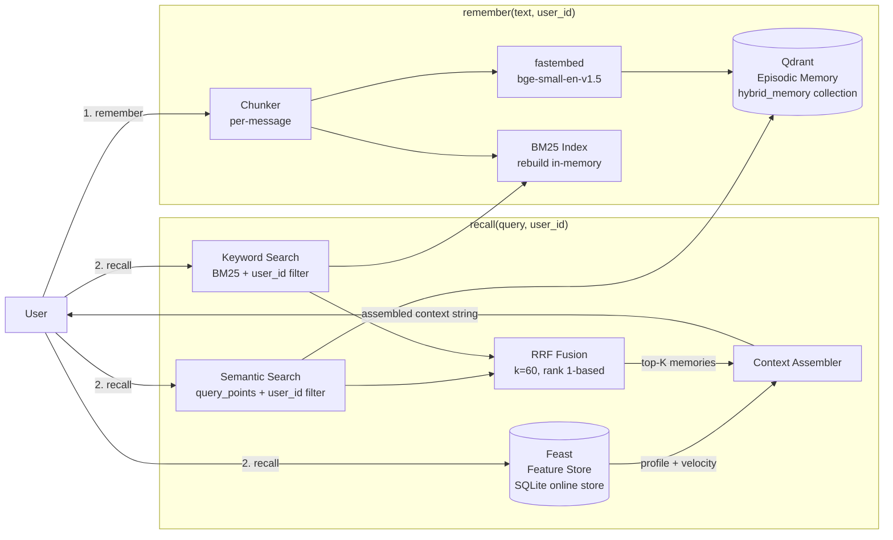

# HybridMemoryAgent — Architecture Document

**Contributors:** Bùi Lâm Tiến
**Lab:** Day 19 Track 2 — Vector Store + Feature Store Bonus Challenge

---

## Mô tả hệ thống

HybridMemoryAgent là một trợ lý AI cá nhân cho người dùng Việt Nam kết hợp hai loại bộ nhớ:

- **Episodic memory** (Vector Store): các đoạn text user đã đọc hoặc lưu, tìm kiếm bằng hybrid search (BM25 + vector + RRF).
- **Stable user profile + recent activity** (Feature Store): ngôn ngữ ưa thích, tốc độ đọc, lĩnh vực quan tâm, và tốc độ query gần đây — lưu trong Feast online store.

---

## Architecture Diagram

Data flow tổng quát:

1. **`remember()`**: text → chunk (per-message) → embed → upsert Qdrant + rebuild BM25.
2. **`recall()`**: (a) lấy user profile từ Feast online store; (b) hybrid search Qdrant filter theo `user_id`; (c) RRF fusion BM25 + vector; (d) assemble context string trả về cho LLM.

---

## Quyết định kiến trúc

### Quyết định 1: Chunking Strategy — Per-message vs Per-conversation vs Semantic-break

**Lựa chọn: Per-message** — mỗi lần gọi `remember(text)` lưu toàn bộ `text` thành một vector duy nhất.

**Tradeoff so sánh:**

| Strategy | Retrieval quality | Storage cost | Complexity | Context window fit |
|---|---|---|---|---|
| **Per-message** (chọn) | Cao — granular, hit đúng đoạn cần | Trung bình | Thấp | Tốt (mỗi message thường < 300 tokens) |
| Per-conversation | Thấp — nhiều topic trộn vào 1 vector | Thấp | Thấp | Xấu — thường vượt 512 tokens của bge-small-en |
| Semantic-break | Rất cao | Cao | Cao — cần segmentation model | Tốt |

**Lý do chọn per-message:** Model `bge-small-en-v1.5` có max input 512 tokens. Một conversation thường dài hơn 512 tokens khi gộp lại, dẫn đến truncation và mất signal. Per-message đảm bảo mỗi chunk fit trong context window. Ngoài ra, retrieval granularity cao hơn: thay vì trả về một đoạn hội thoại dài chứa thông tin không liên quan, hệ thống trả về đúng đoạn text cần thiết. Semantic-break tốt hơn nhưng thêm dependency vào sentence boundary model — overkill cho POC scale.

**Liên hệ lab:** Tương tự quyết định TTL trong `feature_views.py` — per-message giống `query_velocity_features` (TTL=1h, fine-grained), còn per-conversation giống `user_profile_features` (TTL=30d, coarse-grained).

---

### Quyết định 2: Feature Schema — Tabular Features vs Embedding Features

**Lựa chọn: Tabular features** — dùng lại Feast schema đã có từ NB4: `reading_speed_wpm`, `preferred_language`, `topic_affinity`, `queries_last_hour`, `distinct_topics_24h`.

**Tradeoff so sánh:**

| Schema | Interpretability | LLM usability | Engineering cost | Freshness alignment |
|---|---|---|---|---|
| **Tabular** (chọn) | Cao — LLM đọc được "topic_affinity=cloud" | Tốt — text tự nhiên trong context | Thấp — dùng lại NB4 | Hoàn hảo — khớp TTL model của Feast |
| Embedding features | Thấp — vector 384-dim không readable | Xấu — không đưa được vào prompt text | Cao — cần encoder model riêng | Phức tạp — cần custom materialization |

**Lý do chọn tabular:** LLM cần đọc được profile để reasoning. Một câu như "User thích cloud với 187 wpm, hiện đang hỏi nhiều về security" hoàn toàn readable. Ngược lại, 384-dim embedding vector của user preference không thể đưa vào prompt. Ngoài ra, tabular features khớp tự nhiên với mô hình TTL/materialization của Feast: `topic_affinity` ổn định hàng tuần (TTL=30d), `queries_last_hour` thay đổi theo phút (TTL=1h).

**Alternative bị loại bỏ:** Tôi đã xem xét lưu episodic memories dưới dạng embedding feature view trong Feast (một feature `user_embedding` tổng hợp tất cả memories thành 1 vector). Tôi loại bỏ vì re-index cycle của memories và user profile hoàn toàn khác nhau: memories mới xuất hiện mỗi phút (real-time push), trong khi `topic_affinity` thay đổi theo tuần (batch refresh). Gộp chúng vào cùng một feature view sẽ buộc phải chọn một trong hai: over-materialize profile (tốn kém) hoặc stale memories (vô nghĩa cho episodic recall). Tách Qdrant cho episodic và Feast cho profile là đúng vì mỗi hệ thống phục vụ một cadence khác nhau.

---

### Quyết định 3: Freshness Strategy — Sub-second vs 5-minute Batch vs Daily

**Lựa chọn: Chiến lược mixed** phân tầng theo business semantics:

| Loại data | Freshness target | Cơ chế | Lý do |
|---|---|---|---|
| Episodic memory | Sub-second | Direct upsert Qdrant trong `remember()` | User vừa đọc xong → phải tìm thấy ngay |
| Query velocity (`queries_last_hour`) | 5 phút | Feast `materialize-incremental` định kỳ | Lag 5 phút chấp nhận được cho "đang quan tâm gì" |
| User profile (`topic_affinity`, `reading_speed`) | Hàng ngày | Feast `materialize-incremental` daily job | Sở thích thay đổi chậm, daily refresh đủ |

**Tradeoff:** Streaming real-time cho mọi data (Kafka + Flink push vào Feast online store) cho kết quả tốt nhất nhưng thêm ~3 dependency và tăng operational complexity gấp 5 lần. Daily cho tất cả là quá đơn giản: câu "Tôi đang quan tâm gì gần đây?" sẽ trả dữ liệu hôm qua — không acceptable cho một trợ lý cá nhân real-time. Mixed strategy cân bằng được freshness requirement với engineering cost.

**Liên hệ lab:** Quyết định này ánh xạ trực tiếp với 3 TTL tier trong `feature_views.py` đã thiết kế ở NB4.

---

### Quyết định Vietnamese-context: Tokenizer — Whitespace vs underthesea vs pyvi

**Lựa chọn: Whitespace split** — `text.lower().split()`, giống hệt `app/search.py`.

**Bối cảnh tiếng Việt:** Tiếng Việt là ngôn ngữ đơn lập, các âm tiết cách nhau bằng dấu cách, nhưng từ có thể gồm 2–3 âm tiết. Ví dụ: "học sinh" (2 token whitespace) là 1 từ, "tự động mở rộng" (4 token) thực ra là 1 cụm từ. BM25 với whitespace tokenizer sẽ over-segment, làm giảm precision trên compound Vietnamese terms.

**Tradeoff:**

| Tokenizer | Vietnamese quality | English quality | Dependency | Startup time |
|---|---|---|---|---|
| **Whitespace** (chọn) | Trung bình | Tốt | Không | < 1ms |
| `underthesea` | Tốt | Kém — phá vỡ technical terms | ~200MB model | 2–3s |
| `pyvi` | Khá | Kém | ~50MB | ~0.5s |

**Lý do chọn whitespace:** Corpus của hệ thống này là code-switching vi/en nặng — "auto-scaling", "Kubernetes", "zero-trust", "OAuth JWT" là các kỹ thuật từ tiếng Anh xuất hiện trong văn bản tiếng Việt. `underthesea` tokenizes "auto-scaling" thành 2 tokens không rõ nghĩa. Whitespace split giữ nguyên các technical terms tiếng Anh, đây là signal quan trọng nhất cho BM25 trong corpus này. Hơn nữa, trong hybrid search, vector retriever (semantic) bù cho điểm yếu của BM25 trên Vietnamese compound words — như đã thấy trong NB2: `paraphrase` queries không có keyword verbatim thì vector thắng, và hybrid RRF kết hợp cả hai để robust hơn.

---

## Giới hạn của POC này

Hệ thống này chưa xử lý:

- **Privacy isolation per user:** Hiện dùng payload filter (`user_id` trong Qdrant). Production cần encryption per-user hoặc per-user collection để tránh timing attack và admin access. Nghị định 13/2023 của Việt Nam yêu cầu bảo vệ dữ liệu cá nhân.
- **Memory CRUD:** Không có update hoặc delete memory. User không thể sửa hoặc xóa ký ức đã lưu.
- **Memory decay / forgetting:** Không có TTL trên episodic memory. Vector store tăng trưởng không giới hạn. Production cần cohort pruning ("archive memory không truy cập trong 30 ngày").
- **Encryption at rest:** Qdrant in-memory và Feast SQLite lưu plaintext. Production cần encryption at rest.
- **Multi-device sync:** Qdrant in-memory mất data khi restart. Production cần persistent Qdrant server.
- **Profile-boosted re-ranking:** Sau khi hybrid search trả top-K, có thể boost docs khớp `topic_affinity` của user — biến RRF 2 retriever thành 3 retriever. Không implement trong POC để giữ code đơn giản.
